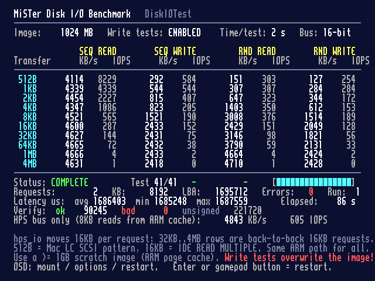

# DiskIOTest for MiSTer

A small utility core that benchmarks the MiSTer disk I/O path the way
CrystalDiskMark does on a PC: sequential and random access, transfer sizes
from 512 B to 4 MB, read and write, one full cycle, live results on screen.
`tools/diskio_bench.py` runs the same matrix natively on the MiSTer's Linux
(or a Raspberry Pi) for comparison.



## What it measures

Every core that emulates a hard disk on MiSTer (Mac LC / Mac Plus SCSI,
Minimig and ao486 IDE, every 8-bit machine with a virtual disk) reaches the SD
card through the same path:

```
core state machine -> hps_io.sv sd_* bus -> Main_MiSTer (user_io_poll)
                   -> file seek/read/write on the mounted image -> Linux exFAT -> SD card
```

DiskIOTest drives that `sd_*` bus directly with no CPU or controller emulation
in between, so the numbers are the ceiling any core can reach:

* **Transfer size** (512 B .. 4 MB). hps_io moves at most 32 blocks (16 KB)
  per request, so transfers above 16 KB are issued as back-to-back 16 KB
  requests at consecutive LBAs, the way a SCSI/IDE controller core splits a
  big command, and are timed as a whole (IOPS = transfers per second). Each
  request costs one ARM poll round trip plus a file operation; the data itself
  moves at the speed of the HPS<->FPGA register bus.
* **Sequential vs random.** Main_MiSTer keeps a 16 KB read-ahead buffer per
  drive, so sequential 512 B reads hit it 31 times out of 32 while random reads
  miss every time. Sequential tests continue from a running cursor so no test
  re-reads a region the previous one touched; random LBAs are spread uniformly
  over the whole image.
* **Read vs write.** The bus is asymmetric (FPGA->ARM needs a bus read per
  word), writes bypass the read-ahead buffer and the SD card itself is much
  slower on small random writes.
* **Latency** min/avg/max per request (queue depth is always 1, so
  IOPS = 1 s / average latency).
* **HPS bus only.** Before the matrix, one extra test re-reads the same 8 KB
  over and over. Main_MiSTer serves those from its read-ahead buffer without
  touching the file, so that line is the pure ARM-poll-plus-bus-transfer
  ceiling, independent of the SD card.

### Does the "subsystem" matter?

Only through the request pattern it produces. The Mac LC `scsi.v` fetches one
512-byte sector per `sd_rd` and pipelines them back to back: its ceiling is the
**512B SEQ READ** row. IDE `READ/WRITE MULTIPLE` as served by `ide.cpp` moves
up to 32 sectors per transfer: the **16KB** rows. The IDE path (`UIO_DMA_*`)
uses the same block-transfer routines on the same bus and is only served for
Minimig/ao486 core types, so it cannot be exercised from a generic core; the
`sd_*` path is the common denominator and is what this core measures.
Everything above the bus (guest CPU PIO speed, controller handshakes, the
guest OS driver) only makes a real core slower than these figures.

### Data integrity

No sector buffer exists in the core: write data is generated from
(LBA, word index) and read data is compared on the fly. Every sector this core
writes starts with `DIOT` + LBA, so on read it can be verified:

* **ok** - signature present, data matches
* **bad** - signature present, data differs (a real problem: bus, ARM or card)
* **unsigned** - sector never written by this core (whatever was in the image)

`tools/verify_image.py` scans an image offline with the same pattern
function, classifies failures (moved / shifted / torn / bad) and can repair
them with `--fix`; it runs on the MiSTer or on a copy of the image.

## Results so far

Measured numbers, and what they say about the MiSTer disk path, are in
[docs/results.md](docs/results.md). In short: the HPS bus tops out at about
4.9 MB/s and sequential reads sit right under it at every request size (a
one-sector-per-request SCSI pattern loses about 13 % against 32-sector IDE
transfers), random reads pay for the ARM's fixed 16 KB read per cache miss,
and writes are bound by the synchronous SD card write behind each request.

## Usage

1. Create a scratch image on the MiSTer. **Write tests overwrite it.** Use at
   least 1 GB so the ARM's page cache cannot hide the SD card; a fully written
   file (not a sparse one) gives representative write numbers:

   ```bash
   mkdir -p /media/fat/games/DiskIOTest
   dd if=/dev/zero of=/media/fat/games/DiskIOTest/scratch_1024M.img bs=1M count=1024
   ```

2. Copy `releases/DiskIOTest_16bit_*.rbf` (16-bit hps_io bus, what current
   cores use) and/or `releases/DiskIOTest_8bit_*.rbf` (8-bit bus, the classic
   `WIDE=0` path of older 8-bit cores) to `/media/fat/_Utility/` and start
   one. Both share the same settings and mounted image, and an image written
   by one build verifies in the other.
3. OSD -> *Mount scratch image*. The cycle starts one second after the mount
   and stops after the last test. MiSTer remembers the mount, so the next
   start of the core runs the benchmark automatically.
4. OSD options: *Time per test* (1/2/4/8 s, default 2 s -> a full cycle takes
   about 50 s), *Write tests* (disable for a read-only look at a real image;
   read-only images skip writes automatically), *Start / Restart*. Enter on a
   keyboard or the first gamepad button also restarts.

The table shows KB/s (KiB) and IOPS per test; while a test runs its cell
updates live and the status lines show requests (transfers), KB, the current
LBA, the latency spread and the progress bar. A cycle is 41 tests: the
bus-only test followed by the 10 x 4 matrix (21 tests with writes disabled);
with 2 s per test it takes a little over 90 s. Transfers larger than the image
are skipped.

## Native comparison: tools/diskio_bench.py

The same benchmark as a stand-alone Python 3 script (standard library only,
works with the MiSTer's Python 3.9 and on a Raspberry Pi). It runs the same
matrix with plain `pread`/`pwrite` at queue depth 1, prints the same table
plus a latency table, and writes a timestamped log (`diskio_<date>_<host>.log`)
into the folder the script lives in:

```bash
# on the MiSTer, against the image the core uses (the core must be idle)
scp tools/diskio_bench.py root@mister:/media/fat/games/DiskIOTest/
ssh root@mister 'cd /media/fat/games/DiskIOTest && python3 diskio_bench.py scratch_1024M.img'

# on a Raspberry Pi: bypass the page cache, which is larger than the file there
python3 diskio_bench.py --direct /path/on/the/card/scratch.img
```

Defaults copy Main_MiSTer's file access (buffered I/O opened with `O_SYNC`,
one syscall per transfer); `--chunk 16K` reproduces the 16 KB request limit
of the hps_io path, `--no-write`, `--time`, `--sizes 512,4K,1M` and
`--drop-caches` are available. The gap between the script's numbers on the
MiSTer and the core's numbers is the cost of the HPS bus and the ARM's per-
request handling; the gap between the MiSTer and a Pi is the card, the
SoC and the file system.

## Building

Quartus Prime 17.0.x (Lite is fine). The project has two revisions built
from the same sources: `DiskIOTest_16bit` (16-bit hps_io bus) and `DiskIOTest_8bit`
(the `DISKIO_BUS8` macro selects `WIDE=0`; the ARM samples the width once per
core start, so it has to be a build option). `scripts/build.sh` compiles the
16-bit one, `scripts/build.sh 8` the 8-bit one, `scripts/build.sh all` both,
and copies the rbfs into `releases/`.
`scripts/deploy.sh` pushes the rbf to a MiSTer over ssh, creates the scratch
image if missing, pre-writes `config/DiskIOTest.s0` so it auto-mounts, and
loads the core. `scripts/screenshot.sh` grabs a screenshot through the
MiSTer Remote API. Copy `scripts/local.env.sample` to `scripts/local.env` for
machine settings.

The static screen, string table and field positions are generated:
`tools/gen_screen.py` writes `rtl/screen_*.hex`, `rtl/strings.hex` and
`rtl/fields.svh`; `tools/gen_font.py` builds the 8x8 font ROM from
Main_MiSTer's OSD font. Re-run them after editing the layout.

## Simulation

`make -C sim run` (16-bit) and `make -C sim run8` (8-bit) build an Icarus
Verilog testbench with a behavioural model
of the ARM side of hps_io (poll latency, block transfer timing, a 2 MB image)
and runs a shortened full cycle, a read-only cycle over a deliberately
corrupted image (every signed sector must be flagged bad) and an unmount in
the middle of a run. `make -C sim lint` runs Verilator on the core modules.

## Design notes

See [docs/PLAN.md](docs/PLAN.md). Everything runs at 50 MHz from the core
PLL: `rtl/bench.sv` (sequencer, request engine, statistics with a serial
divider, results RAM), `rtl/pattern.sv` (data generator/verifier),
`rtl/text_video.sv` (80x30 text mode on 640x480), `rtl/text_update.sv`
(walks the generated field table and rewrites the dynamic cells).
